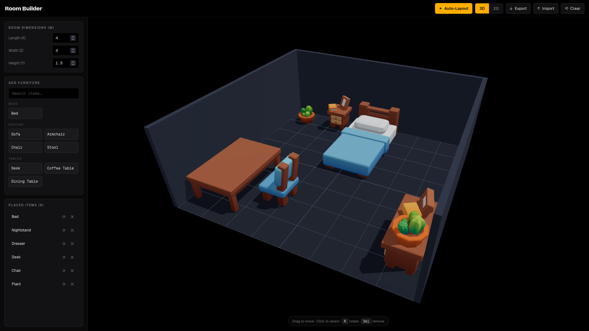

# Room Builder

A browser app for designing a room in 3D. You set the room size, add low-poly
furniture from a sidebar, and move, rotate, and snap pieces into place. It can
auto-generate a furniture layout (a new one each time), and you can switch
between a 3D view and a 2D top-down view. Layouts can be saved and exported as
JSON.

Built with React, TypeScript, Three.js, and React Three Fiber. Furniture is the
KayKit "Furniture Bits" low-poly pack.



## Run it

```bash
npm install
npm run dev      # http://localhost:5173  (add ?demo=1 to start with a sample layout)
npm run build    # production build
npm run test     # unit tests
```

## Main features

- Set room length, width, and height.
- One-click auto-layout that varies every time.
- Drag, rotate (90 steps), and snap furniture to a 10 cm grid, with collision
  checks so pieces never overlap or clip through walls.
- Searchable furniture palette grouped by category (beds, seating, tables,
  storage, lighting, decor, rugs), with multiple model options per item.
- 3D and 2D views, a custom accent color, and JSON export/import.
- Works on desktop, tablet, and mobile.

